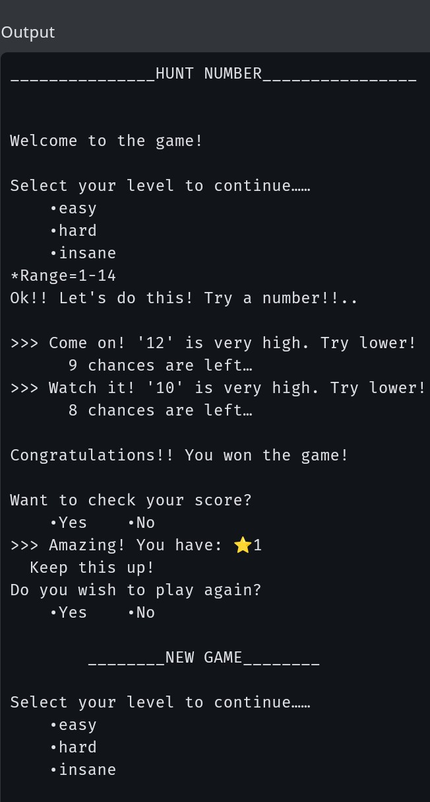
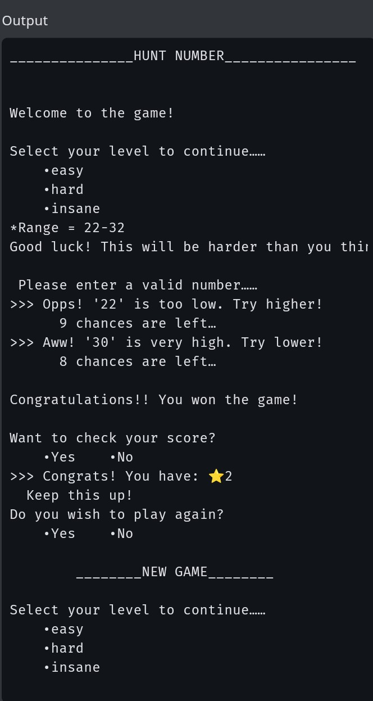
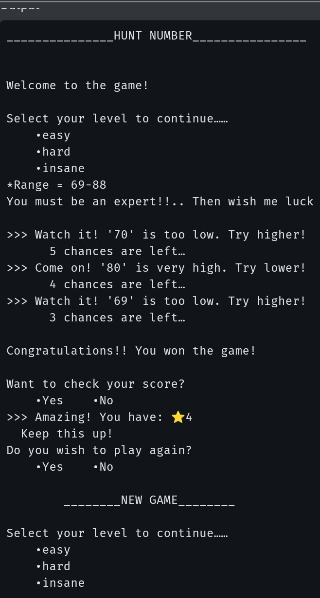

# Hunt Number Game

A simple Python number guessing game with 3 difficulty levels.

## How to Play
1. Choose a difficulty: easy, hard, or insane
2. Guess the number within the given range
3. You get hints if your guess is too high or too low
4. Earn stars based on difficulty level

## Difficulty Levels
- **Easy**: Range 1-10, 10 chances, 1 star
- **Hard**: Range 10-40, 10 chances, 2 stars  
- **Insane**: Range 50-100, 6 chances, 4 stars

## How to Run
```bash
python guess-and-win.py

## 📸 Gameplay Screenshots

### Easy Level - Range 1-14


### Hard Level - Range 1-100


### Insane Level - Range 1-1000



